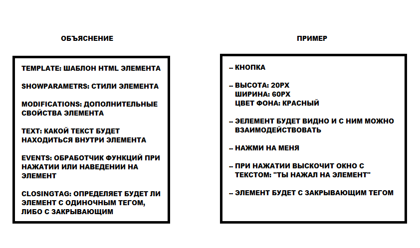

Тестовое задание для компании SIMAI - https://simai.ru/

## Техническое задание
Создайте генератор html-элементов

Описание
Необходимо написать класс Component для генерации элементов на странице сайта. В текущем задании нет необходимости генерировать всевозможные html-элементы. Достаточно будет генерации нескольких видов кнопок. 
В зависимости от переданных параметров класс Component должен создавать разный вид одного и того же элемента страницы.
На вход классу Component приходят данные о создаваемом элементе:
    1) Шаблон – шаблон (html представление) элемента страницы;
    2) Параметры отображения – с их помощью можно менять внешний вид элемента страницы;
    3) Модификаторы – предназначены для «тонкой настройки» отображения элемента страницы;
    4) Текстовые значения, которые могут содержать элементы страницы;
    5) События – перечень действий на каждое событие.
На выходе должны получить сгенерированный элемент страницы, созданный классом Component в зависимости от входных данных.

Функциональные требования
Использование нативного JavaScript

## Описание проекта
Решение написано для облегчённого создания HTML-элементов.

Проект представлен как тестовый стенд возможностей программиста.

Основное решение к проекту было найдено и реализовано за приблизительно 3 часа.

## Решение
Вначале, чтобы сделать HTML элемент создаётся класс Component, который будет содержать в себе все свойства будущего элемента.

```JS
class Component {

    constructor({
        template = null,
        showParameters = null,
        modifications = null,
        text = null,
        events = null,
        closingTag = true ,
    }){
        this.template = template
        this.showParameters = showParameters
        this.modifications = modifications
        this.text = text
        this.closingTag = closingTag
        this.events = events
    }

    generateHtml() {

        let showParameters = ''
        let modifications = ''
        let events = ''
        let id = self.crypto.randomUUID()
        let onClick = null
        let onMouseOver = null

        if (this.showParameters !== null) showParameters = this.showParameters.getRawStyle()
        if (this.modifications !== null) modifications = this.modifications.getRawStyle()
        if (this.events !== null)  onClick = this.events.getOnClickEvent()
        if (this.events !== null) onMouseOver = this.events.getMouseOverEvent()

        let element

        if (this.closingTag === true) {
            element = this.#generateWthoutClosingTag({showParameters: showParameters, modifications: modifications, id: id})
        } else{
            element = this.#generateWithClosingTag({showParameters: showParameters, modifications: modifications, id:id})
        }

        let template = document.createElement('template')
        let html = element.trim()
        template.innerHTML = html
        let htmlObject = template.content.firstChild        
        document.body.appendChild(htmlObject)
        let createdElement = document.getElementById(id)
        createdElement.addEventListener('click', () => onClick()) 
        createdElement.addEventListener('mouseover', () => onMouseOver()) 

        return htmlObject
    }

    #generateWthoutClosingTag({showParameters, modifications, id}) {
        return `<${this.template} style="${showParameters}${modifications}" id="${id}" />`
    }

    #generateWithClosingTag({showParameters, modifications, id}) {
        return `<${this.template} style="${showParameters}${modifications}" id="${id}">${this.text}</${this.template}>`
    }
    
}
```




Для ShowParametrs, Modifications и Events необходимо было создать классы, чтобы принимать данные от пользователя и обрабатывать их.

```JS
class ShowParameters {

    constructor({
        height = null,
        width = null,
        color = null
    }) {
        this.height = height
        this.width = width
        this.color = color
    }

    getRawStyle() {
        return `height:${this.height}px;width:${this.width}px;background-color:${this.color}`
    }
}

class Modifications {

    constructor({
        disable = false,
        hidden = false
    }) {
        this.disable = disable
        this.hidden = hidden
    }

    getRawStyle() {
        return this.disable === true ? 'pointer-events:none;' : '', this.hidden === true ? 'visibility: hidden;' : ''
    }
}

class Events{ 
 
    constructor({ 
        onClick = null,
        onMouseOver = null
    }){ 
        this.onClick = onClick
        this.onMouseOver = onMouseOver  
    } 
 
    getOnClickEvent(){ 
        return this.onClick
    }
    getMouseOverEvent(){
        return this.onMouseOver
    } 
 
} 
```

Здесь же представленны все свойства и параметры, которые можно присвоить элементу. Код приспособлен к добавлению новых свойств элемента без особых трудностей.

### Пример создания HTML элемента:

Код:

```JS
    const button = new Component({
        template: 'button',
        showParameters: new ShowParameters({height: 50, width: 100, color: "yellow"}),
        events: new Events({onClick: hello}),
        text: 'Hello',
        closingTag: true
    })

    function hello(){
        alert('Hello')
    }
```

Что получится:


## Технологический стек
- Javascript

